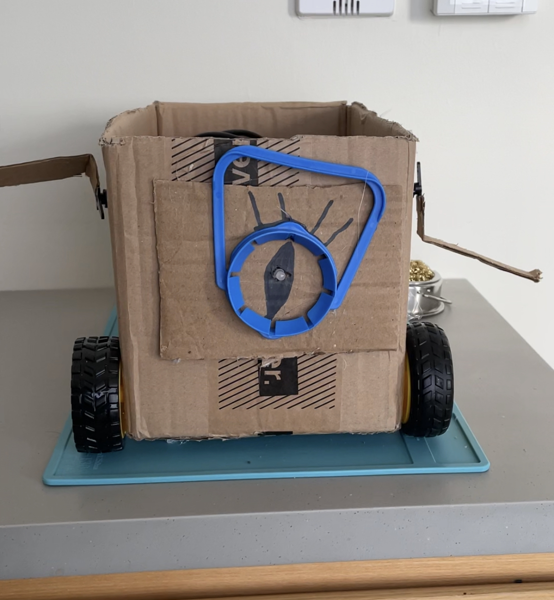

# Midterm Project Documentation

Hello there! Welcome to my little performance, curated by Amina & Two Robots.

[Full video recording is available here]()

## Introduction

Inspiration behind this performance is the Disney created TV-series called Gravity Falls. There's a fantasy character Bill Cipher, a demon who likes to make "deals" with other characters in the show.

Given Bill's role in the show, I decided to create a robot that would drive around "singing" the Gravity Falls intro song and that can get furious while shaking hands to make a deal. Hence the robot's expressive elements are:
- one LED eye color,
- two DC motor legs,
- two servo motor hands, and
- one buzzer to output the melody.

## Performance Instructions

Using the second Arduino that sends a radio signal, it is possible to trigger three different states:
1. The first button performs a happy Bill singing and driving around,
2. The second button performs a furious/restless Bill who is signing a deal,
3. The third button stops all of the movements.

## Process and Challenges

A full description of the process and technical challenges is available in my [journal here.](github.com/ak7588/performingRobots/midtermProject/journal.md)

## Final Reflections

As someone who has never programmed/made/engineered a moving robot before, to say that I am impressed with what I've built is an understatement! I am surprised and amazed with what simple tools like cardboard, a few motors, and plastic handles can do. Most importantly, I feel like I was able to learn and practice essential hardware/software practices like watching out for short circuits, frequently checking the battery, and writing clean code (and without delay) for the Arduino.

