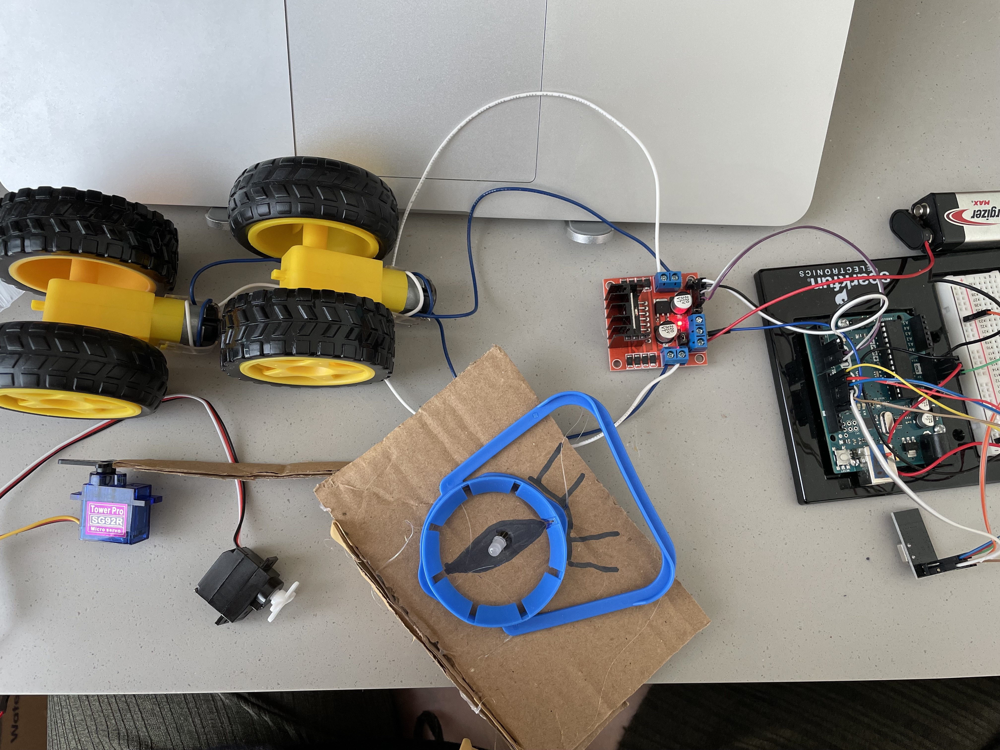
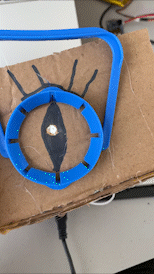
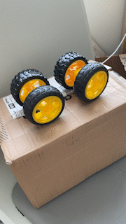
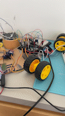

# Midterm Project Journal

## Idea:

Expressive robot that can move with two motors, change its eye color, move its hands and make sounds depending on its mood. The goal is to make the robot move forward, have green eyes, and play pleasant music notes while it has a great mood. Whenever robot has a bad mood, it will have red eyes, it stops moving forward, starts shaking hands, and plays angry sounds.

## October 2nd, 2021:
- Started to work on the project: developed the idea, build a simple circuit with two motors, two servos, and the neopixel board.

- Broke my second Arduino, so will have to replace. Here's a video I took just before it broke:

Actionable items for next time:
- Get a working Arduino.
- Connect the audio/sound sensor.
- Write simple code to test the robot expressions.

## October 3rd, 2021:
- Made my Arduino work (there was a short circuit!)
- Connected the audio buzzer and tested basic music notes playing
- (Re)connected servo motors and made sure they work
- Started to write some basic code for the robot to execute (HUGE milestone: debugged the "delay()" issue and wrote code with millis() instead)

Actionable items for next time:
- Code the neopixel board
- Right now all of the devices work in separate, next time I want to make sure when they all work together nothing breaks
- Start working on the robot appearance if the code is ok

## October 5th, 2021:
- Soldered and connected the RGB LED to the circuit. Soldering was needed so that it can be accessed form wires outside of the breadboard to reach the robot's eye
- Coded the RGB LED to map for the robot's state (happy or angry)
- Coded the buzzer to work without delay

Actionable items for next time:
- Connect the servo motors and code
- Continue working on basic design

## October 7th, 2021:
- RGB, buzzer, and motor work altogether 🎉
- Connected servo motors and made them work without delay
- Started working on the cardbox appearance
- Update: motors stopped working at the same time, only one works at a time

Actionable items for next time:
- Figure out what is wrong with the motors or the battery. Tried to tweak them a few times -- each works well by itself, but not at the same time.
- Continue working on the appearance

## October 10th, 2021:
- Fixed the motors by replacing the battery

Actionable items for next time:
- Advance the code to perform a sequence without needing to re-press buttons
