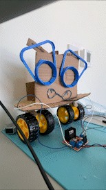

# 🤖 Welcome Bob - my first performing robot!

Firstly, let me define what is a robot. 

#### A robot is a programmed hardware that can perform a set of commands defined by the programmer. A robot *can* have a special physical appearance for a better audience impression, but it's not required to.

# 🕺 The Performance

Here is the final (and the best of all) performances of Bob. Bob is just learning how to "walk" (drive) and is trying to move back and forth. Hence the awkaradness in movements. Please be patient while Bob is taking his first steps.

# 🔧 How it all works?

Now let's dive into the process. Before having the final version of my robot, I spent some time trying to (1) physically build a robot that can move with wheels, (2) write good code so that wheels can actually move.

Take a look at some of the failed attempts to build Bob:

(Failed Version #1: a version of Bob with the unsustainable physique)

(Failed Version #2: a version of Bob that can't properly move because of wrong code)

Finally, after tinkering around with Bob's physique, I was able to build this final look:

You are probably wondering how the wheels work -- I connected them with a piece of cardbox that I glued to the plastic part of the motor. I was too scared to glue motors directly as it could damage them, so cardbox seemed like a quick workaround. This version of wheel placement came after the first unsuccessful attempt to build Bob (see Failed Version #1 above).
